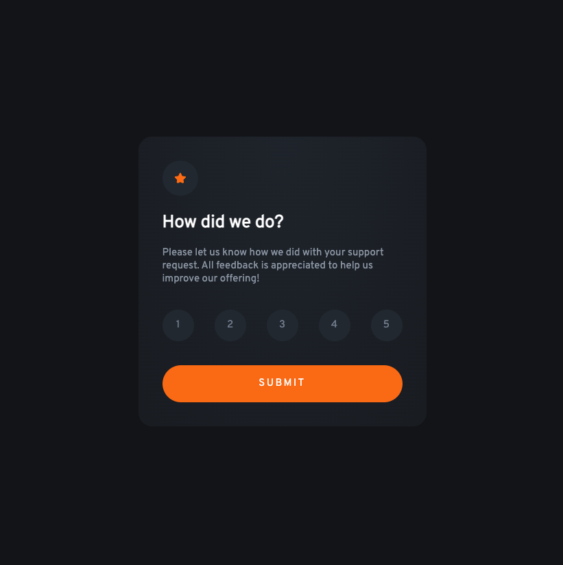

# Frontend Mentor - Interactive rating component solution

This is a solution to the [Interactive rating component challenge on Frontend Mentor](https://www.frontendmentor.io/challenges/interactive-rating-component-koxpeBUmI). Frontend Mentor challenges help you improve your coding skills by building realistic projects. 

## Table of contents

- [Overview](#overview)
  - [The challenge](#the-challenge)
  - [Screenshot](#screenshot)
  - [Links](#links)
- [My process](#my-process)
  - [Built with](#built-with)

## Overview

### The challenge

Users should be able to:

- View the optimal layout for the app depending on their device's screen size
- See hover states for all interactive elements on the page
- Select and submit a number rating
- See the "Thank you" card state after submitting a rating

### Screenshot



### Links

- Solution URL: [https://www.frontendmentor.io/solutions/interactive-rating-component-zpBX29QZyf](https://www.frontendmentor.io/solutions/interactive-rating-component-zpBX29QZyf)
- Live Site URL: [https://andrecaldeiras.github.io/Interactive-Rating-Component/dist/](https://andrecaldeiras.github.io/Interactive-Rating-Component/dist/)

## My process

### Built with

- Semantic HTML5 markup
- CSS custom properties
- Flexbox
- CSS Grid
- Mobile-first workflow
- SASS
- Pug

```pug
.card__ratings(name="ratings")
                        .card__ratings-input
                            input.ratings-input(type="radio" name="rating" id="1" value="1")
                            label.ratings-label(for="1") 1
                        .card__ratings-input
                            input.ratings-input(type="radio" name="rating" id="2" value="2")
                            label.ratings-label(for="2") 2
                        .card__ratings-input
                            input.ratings-input(type="radio" name="rating" id="3" value="3")
                            label.ratings-label(for="3") 3
                        .card__ratings-input
                            input.ratings-input(type="radio" name="rating" id="4" value="4")
                            label.ratings-label(for="4") 4
                        .card__ratings-input
                            input.ratings-input(type="radio" name="rating" id="5" value="5")
                            label.ratings-label(for="5") 5
                    input.card__button(type="submit" value="Submit") 
```
```sass
@mixin title()
    color: $n--white
    font-size: 1.6rem
    margin: 5% 0
```
```js
submit.addEventListener("click", function() {
    const rating = document.querySelector(".ratings-input:checked").value;
    console.log(rating)
    if (rating == 0) {
        alert("Please input a valid rating");
    }
    else {
        cardSubmitted.classList.toggle("card__state--hidden");
        cardNormal.classList.toggle("card__state--hidden");
        selectedText.textContent = "You selected " + rating + " out of 5";
    }
});
```
